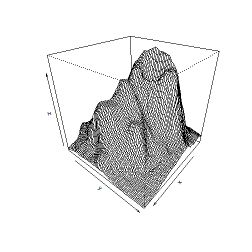

## Motivations

* Create a functional ShinyApp with interactive features
* Keep the package simple, as requested
* Avoid any graphical tasks on the server end (everything on the client)
* Be original, going beyond statistical bargraphs

--- &twocol w1:40% w2:60%
## Principles

The app ([here, by the way](http://simabo.shinyapps.io/ShinyVolcano)) loads one of the default R datasets, "Volcano". This dataset of Mount Eden ('Maunga Whau', in Auckland, New Zealand) is used to reproduce the topology.

We use the [persp](http://stat.ethz.ch/R-manual/R-patched/library/graphics/html/persp.html) function to create a mesh from the matrix of points:

*** =left
```
z <- volcano
x <- (1:nrow(z))
y <- (1:ncol(z))
persp(x, y, z, theta = 130, phi = 30)
```

*** =right
 

--- .class #id 

## Limitations
Calculations and rendering being done in software mode (i.e., not using any hardware-acceleration technique), there is a serious lag of 1-2 seconds between user interaction and screen update.

This shouldn't be a problem as the exercise was about the interaction itself and not the end result.

--- .class #id 

## Improvements
Here is a list of improvements that any interested reader can try at home:
* Switch from ```persp``` to ```persp3d```, using the RGL Package in Shiny (see next slide)
* Implement zooming
* Implement a color picker to change the shading
* Allow direct topology download (see the Digital Elevation Models accessible after registration on [EarthExplorer](http://earthexplorer.usgs.gov/))

--- .class #id 

## Where to go from there?
If you want to experiment further with topological data in R, take a look at:
* [this PDF](http://cran.r-project.org/web/packages/plot3D/vignettes/volcano.pdf) listing various ways to have fun with R and the Volcano dataset
* [Shiny-RGL](https://github.com/trestletech/shinyRGL) which is a Shiny wrapper for the [RGL package](https://r-forge.r-project.org/projects/rgl/). It allows you to use RGL, an openGL package for R, in ShinyApps. Using it would allow you to directly move the volcano with the mouse, instead of relying on sliders to move the point of view.
* [GeoTheory](http://geotheory.co.uk/blog/2014/02/07/visualising-topography/) also has some nice experiments with maps and R.

_Thanks for reading, have fun!_
